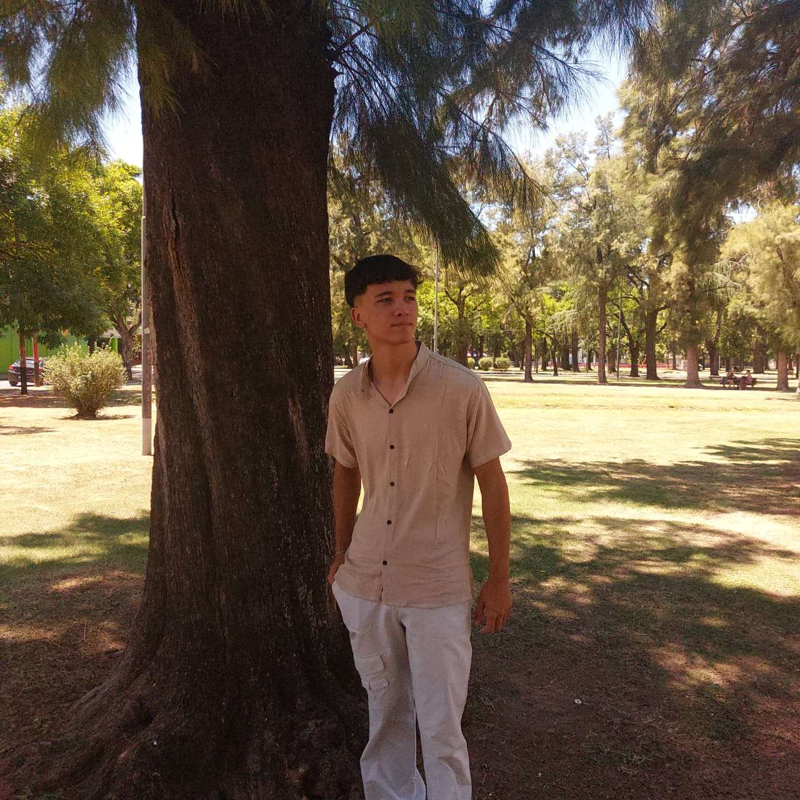

# Presentación - Paradigmas de Programación

## Datos Personales
    **Nombre:** [Santiago Zarate Schoenfeld]
    **Legajo:** [222.804-0]
    **Foto:** 

## Sobre mi
    Hola, Soy de José C.Paz y este es mi tercer año de cursada en la facultad.
    Me recibi en un colegio secundario privado pero nunca tuve computación ni nada relacionado, por lo que no tengo formación previa en programación más que Algoritmos y algun que otro video visto de Programacion ATS en C++.
    Por esto me interesa aprender sobre esto, además de que en el futuro me gustaria trabajar de algo relacionado a ciberseguridad, desarrollo de videojuegos u inteligencia artificial. 

## Hobbies
    Me gusta ir al gimnasio, entrenó calistenia y Sanda, además soy gamer. 
